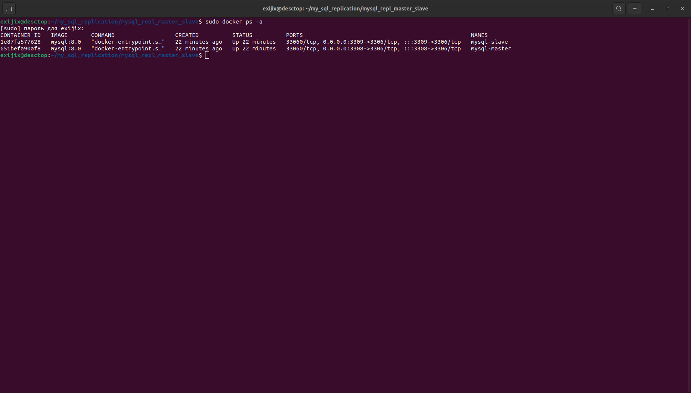

# Домашнее задание к занятию «Репликация и масштабирование. Часть 1» Dmitry Kolb

## Задание 1

На лекции рассматривались режимы репликации master-slave, master-master, опишите их различия.
Ответить в свободной форме.

### решение 

#### Ключевые различия:
| Параметр | Master-Slave | Master-Master |
| ------------- | ------------- | ------------- |
| Количество ведущих серверов | 1 | 2 и более |
| Запись | Только на Master | На всех Master |
| Чтение | На всех Slave | На всех Master |
| Доступность | Master — точка отказа | Высокая (без точки отказа) |
| Конфликты | Нет | Возможны |
| Простота настройки | Проще | Сложнее |

Выбор режима зависит от задач:
* Master-Slave подходит для систем с большим числом операций чтения.
* Master-Master — для распределённых систем с интенсивной записью и высокой отказоустойчивостью.
    
## Задание 2

Выполните конфигурацию master-slave репликации, примером можно пользоваться из лекции.

Приложите скриншоты конфигурации, выполнения работы: состояния и режимы работы серверов.

### решение

